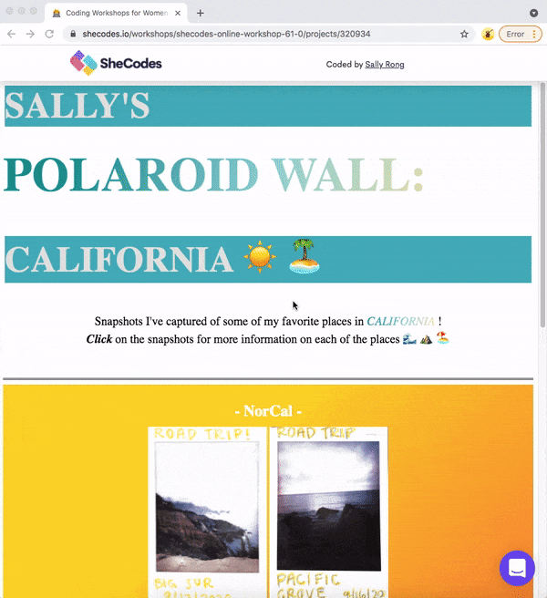

# Front-end Practice: Polaroid Wall Webpage <h1> 

A [webpage](https://www.shecodes.io/workshops/shecodes-online-workshop-61-0/projects/320934) that displays Polaroid pictures I've captured from my favorite spots in California!

A fun project I made using HTML, CSS, and Javascript! 

I completed this project as part of my Introduction to Coding [certificate](https://www.shecodes.io/certificates/aad0b53b9a81c1a77559e7c8eb591089) through SheCodes.

